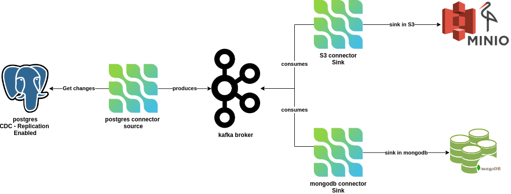

### README

# Docker Compose Setup for Data Flow Services

This Docker Compose setup includes several services for a data flow pipeline, organized into three main categories: Source, Orchestration, and Sink. These services are configured to work together to provide a comprehensive data streaming and management solution. 

## Services

### Source

#### PostgreSQL (Relational Database)

- **Image**: `postgres:${POSTGRES_VERSION}`
- **Container Name**: `postgres-df`
- **Ports**: `5432`

### Orchestration

#### Kafka Broker

- **Image**: `bitnami/kafka:${KAFKA_VERSION}`
- **Container Name**: `kafka-broker-df`
- **Ports**: `9092`

#### Schema Registry

- **Image**: `bitnami/schema-registry:${SCHEMA_REGISTRY_VERSION}`
- **Container Name**: `schema-registry-df`
- **Ports**: `8081`
- **Depends On**: `kafka-broker-df`

#### Kafka Connect with Debezium

- **Image**: `debezium/connect`
- **Container Name**: `kafka-connect-df`
- **Ports**: `8083`
- **Depends On**: `kafka-broker-df`, `postgres-df`

#### Redpanda Console

- **Image**: `docker.redpanda.com/redpandadata/console:${REDPANDA_VERSION}`
- **Container Name**: `redpanda-console-df`
- **Ports**: `8080`
- **Depends On**:
  - `kafka-broker-df`
  - `schema-registry-df`
  - `kafka-connect-df`

### Sink

#### MinIO (Data Lake)

- **Image**: `minio/minio:${MINIO_VERSION}`
- **Container Name**: `minio-df`
- **Ports**: `9000` (MinIO), `9001` (MinIO Console)

#### MongoDB (NoSQL Database)

- **Image**: `mongo:${MONGODB_VERSION}`
- **Container Name**: `mongodb-df`
- **Ports**: `27017`

#### Mongo Express

- **Image**: `mongo-express:latest`
- **Container Name**: `mongo-express-df`
- **Ports**: `8091`

**The versions of the containers are specified in a `.env` file available in the project.**

## Networks

- **dataflow_network**: A custom bridge network for inter-service communication.

## Access URLs

- **Kafka Broker**: `localhost:9092`
- **Schema Registry**: `http://localhost:8081`
- **PostgreSQL**: `localhost:5432`
  - **User**: `postgres`
  - **Password**: `postgres`
- **Kafka Connect**: `http://localhost:8083`
- **MinIO**:
  - MinIO Console: `http://localhost:9001`
    - **User**: `admin`
    - **Password**: `minioadmin`
  - S3 Endpoint: `http://localhost:9000`
- **Redpanda Console**: `http://localhost:8080`
- **MongoDB**: `localhost:27017`
  - **User**: `admin`
  - **Password**: `pass`
- **Mongo Express**: `http://localhost:8091`
  - **User**: `admin`
  - **Password**: `pass`

## Data Flow

1. **Source**: Data is ingested from the PostgreSQL database.
2. **Orchestration**: Kafka serves as the streaming platform, with Schema Registry managing the schemas, and Kafka Connect with Debezium capturing changes from PostgreSQL.
3. **Sink**: Processed data is stored in MinIO (data lake) and MongoDB (NoSQL database), with Mongo Express providing a web-based MongoDB admin interface.

This setup provides a comprehensive data flow pipeline with PostgreSQL as the data source, Kafka for data streaming and orchestration, and MinIO and MongoDB as data sinks, all managed and monitored through various consoles and interfaces. 
